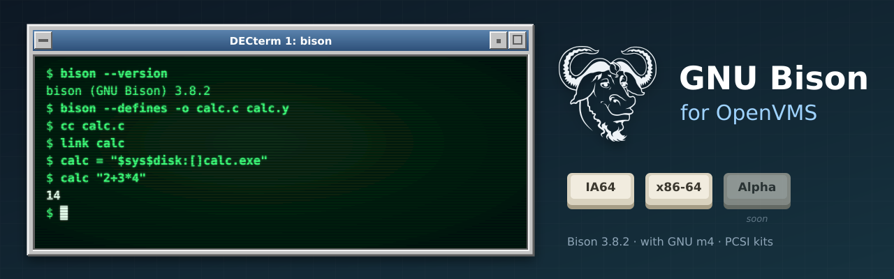

<p align="center">
  
</p>

# GNU Bison for OpenVMS

[GNU Bison](https://www.gnu.org/software/bison/) (**3.8.2**), the parser generator, built
natively for OpenVMS on **IA64** and **x86-64**, following Bison's own releases. Bison runs
GNU m4 to generate its parsers; it uses [GNU m4 for OpenVMS](https://github.com/issinoho/vms-m4).
It belongs to the same family as [GNU grep](https://github.com/issinoho/vms-grep),
[GNU sed](https://github.com/issinoho/vms-sed), [GNU awk](https://github.com/issinoho/vms-awk),
[GNU Wget](https://github.com/issinoho/vms-wget), [curl](https://github.com/issinoho/vms-curl),
[zlib](https://github.com/issinoho/vms-zlib) and [PCRE2](https://github.com/issinoho/vms-pcre2)
for OpenVMS.

This repository holds **only our changes**: every build starts from the signed GNU release
tarball (Akim Demaille's key, pinned in `keys/`), applies our patches and adds our VMS
files. As for grep, sed, m4 and Wget, Bison's own `configure` runs on a Linux host with
every compile and link test sent to VSI C on the node, and MMS builds the result.

## Status

**In progress; no release yet.** The VSI C configure runs are under way on both nodes; the
build, smoke test and PCSI kit follow.

| | IA64 (OpenVMS V8.4-2L3, VSI C 7.4) | x86-64 (OpenVMS E9.2-4, VSI C 7.7) |
|---|---|---|
| VSI C configure answers | in progress | in progress |
| Builds | pending | pending |
| Smoke test (generate a parser, compile and run it, errors) | pending | pending |
| PCSI kit (`BISON`, `V3.8-2E1`, requires `M4`) | pending | pending |

## On VMS

- **Running m4.** On Unix Bison talks to m4 through two pipes; OpenVMS has no `fork()`.
  Bison writes all of m4's input before reading any of its output, so here files do the
  work: m4's input and output are temporary files in `SYS$SCRATCH`, and m4 is started with
  `vfork()`/`execv()` (patch 0006). The M4 kit's `M4$ROOT:[BIN]M4.EXE` is the default; the
  `M4` logical name overrides it.
- **Data files.** Bison's skeletons and m4 library are installed in `BISON$ROOT:[DATA...]`;
  the `BISON_PKGDATADIR` logical name overrides the location.
- **Upper-case options in batch jobs.** Under the TRADITIONAL DCL parse style unquoted
  options reach Bison in lower case: `-H` (header) becomes `-h` (help). Use the long options
  (`--defines`), quote the short ones (`"-H"`), or `$ SET PROCESS/PARSE_STYLE=EXTENDED` first.
- **Exit status.** Under DCL a failed run has error severity, so `ON ERROR` works; under a
  GNV shell, `$?` is the exit code as on Unix.

## Patches

| Patch | Purpose |
|---|---|
| 0001 | `lib/malloc/scratch_buffer.h`: avoid the member name `__align`, a VSI C keyword. |
| 0002 | `configure`: look for `struct sched_param` in `<pthread.h>` for host `openvms*`. |
| 0003 | `lib/getprogname.c`: VMS implementation. |
| 0004 | `lib/stdlib.in.h`: route `exit()` through `vms_exit()` for an error-severity status under DCL. |
| 0005 | `lib/*.c`: include `float+.h` as `float_plus.h` (VSI C does not find a name with `+`). |
| 0006 | `src/output.c`, `src/files.c`: run m4 without `fork()` (temporary files, `vfork()`/`execv()`); VMS defaults for the m4 image and the data directory. |

0001-0005 are the gnulib fixes of the m4, sed and Wget ports.

## How to build

The build and smoke test need [vms-m4](https://github.com/issinoho/vms-m4) built on the node
(`M4_TREE` in `upstream.conf`). Set up `tools/nodes.conf` as described in
[vms-grep's README](https://github.com/issinoho/vms-grep#2b-build-on-vms-from-the-host-over-ssh).

```sh
git clone https://github.com/issinoho/vms-bison.git
cd vms-bison
tools/vms_configure.sh ia64 # VSI C configure run, about an hour (once per Bison release)
tools/prepare.sh            # fetch + verify, patch, configure with the VSI C answers, MMS lists
tools/build.sh ia64         # upload, then @[.VMS]BUILD on the node (MMS)
tools/test.sh ia64          # smoke test (uses the node's m4 build)
tools/kit.sh ia64           # PCSI kit -> out/kits/
```

## Artwork

`docs/images/banner.svg` and `docs/images/icon.svg` were made for this project in the style
of classic DECwindows and VT terminals, like those of its sibling ports. The GNU head is by
Aurelio A. Heckert, used under the terms on <https://www.gnu.org/graphics/heckert_gnu.html>.

## Licence

GNU Bison is free software under the GNU General Public License, version 3 or later; see
`COPYING`. Our patches and VMS files are distributed under the same terms. Parsers Bison
generates may be distributed under the terms of the Bison exception in the generated files.

OpenVMS is a trademark of VMS Software, Inc. This project is not affiliated with VMS
Software, Inc. or with the GNU project.
